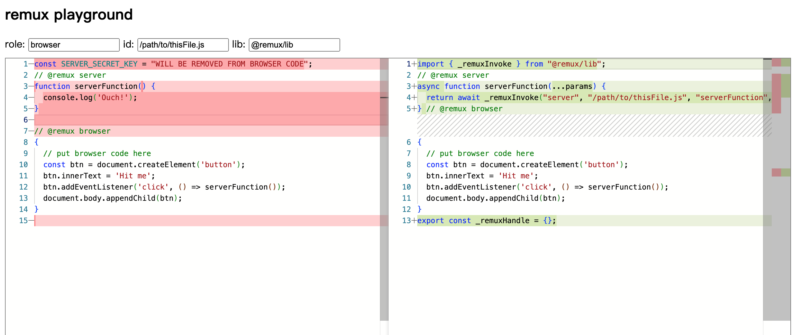

# remuxjs

Try it on [stackblitz](https://stackblitz.com/github/remuxjs/example?file=src/main.js).

[Playground](https://remuxjs.github.io/docs/zh_CN/master/_static/playground/)

[Documentation](https://remuxjs.github.io/docs/en/master/start/brief.html) [中文文档](https://remuxjs.github.io/docs/zh_CN/master/start/brief.html)

